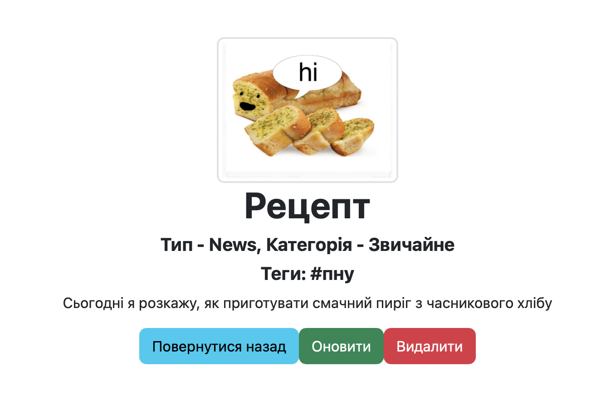

# WebDevPython
Laboratory works from WebDev (3rd year)
Control Work

Number 14 (BasicAuth, JWT)

Number 13 (REST, Jsonify)

Number 12 (Unittest, Pytest)

Number 11 (Posts, 1-M, M-M, Pagination)

Number 10 (Blueprint, Factory)

Number 9 (Account, images, change password)

